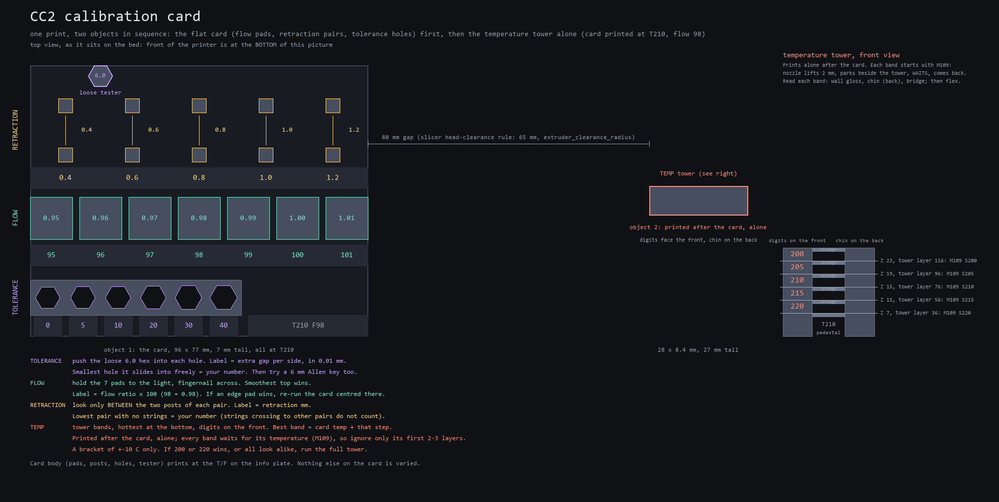

# CC2 calibration card (one print: flow, retraction, tolerance, temp bracket)

One small plate instead of the four prints in `calibration/README.md` (temp
tower 55 min + flow YOLO 20 + retraction 20 + tolerance 12 = ~1.75 h). It is a
**bracket check around values you already roughly know** (stock preset or a
previous calibration), not a sweep of the whole material range. That is what
makes it short. Every result has an embossed label next to it, so reading it is
one glance per row.



## Print it

- **`CC2_CalibCard_PLA_T210_F98.gcode`**: the full card, tower included, as
  **two objects printed one after the other**: the flat card first (all of it
  at the card temperature), then the temperature tower alone, 80 mm to its
  right. Sliced for plain Elegoo PLA (`Elegoo PLA @ECC2`) at **210 C / flow
  0.98** (the stock values; the emoji PLA card from its calibrated 1.00 would
  be `--flow 1.00`). Estimated **46 min 29 s** plus the five temperature waits
  (not in the estimate; a few tens of seconds each), **7.3 g**; footprint
  204 x 77 mm centred on the bed (card 96 x 77 x 7 mm, tower 28 x 9 x 27 mm).
- **`CC2_CalibCardFlat_PLA_T210_F98.gcode`**: the same card without the
  temperature tower, one object printed the normal way (**27 min**, **5.2 g**,
  7 mm tall). Use it when the temperature is already settled and you only want
  flow / retraction / fit.

Both select **CANVAS slot 1 (`T0`)**: put the filament under test in slot 1
(current slots: `filaments/README.md`). Centauri Carbon 2, 0.4 mm nozzle,
**textured PEI**, door as usual (shut is fine for PLA), 100% speed, no brim, no ironing. Print
conditions are otherwise the author's normal ones (`tools/slice_cc2.py`
with `--accel antiwobble`, stock 0.20 mm process; the checked-in G-code was sliced that way), so the answers apply to real prints. One
deliberate exception: the minimum layer time is **8 s** instead of the stock
4 s, so the hollow 4 mm posts and the tower pillars get time to cool between
layers (it costs +4 min 40 s on the full card, +8 s on the flat one).

Generated with ElegooSlicer 1.5.3.5 through `tools/slice_cc2.py`,
2026-09-27. **Checked in G-code only, not yet printed** (see the end).

## Read it (front of the printer = bottom of the map)

The card body prints at the temperature and flow on its info plate
(`T210 F98`). Only the labelled things below are varied.

| Row (front to back) | Look at | Label means | Pick | Record in `filaments/<slug>.md` |
|---|---|---|---|---|
| **Tolerance** rail, 6 hex holes + the loose 6.0 hex tester | push the tester into each hole by hand, no force; then a 6 mm Allen key | extra gap **per side** in 0.01 mm: `0 5 10 20 30 40` = 0 / 0.05 / 0.1 / 0.2 / 0.3 / 0.4 mm (holes 6.0 / 6.1 / 6.2 / 6.4 / 6.6 / 6.8 across flats) | the **smallest** hole the tester slides fully in and out of freely | `tolerance_free_at_mm: 0.2` (and, if you measure, tester and 0.2 hole across flats, see the full procedure Step 4) |
| **Flow**, 7 pads | hold them to the light at an angle, run a fingernail across each top | **flow ratio x 100**: `95 96 97 98 99 100 101` around the card's 0.98 | the **smoothest** top: no gaps between lines (too little), no ridges (too much); ties go to the one nearer the centre | `flow: 1.00` (the label / 100, no arithmetic) |
| **Retraction**, 5 pairs of posts | strings **between the two posts of a pair**, and the post walls where printing resumes after each travel (blobs, gaps or thin spots there = the restart is not clean); ignore wisps that cross to another pair or to the tower | retraction length in mm: `0.4 0.6 0.8 1.0 1.2`. Retract speed (30 mm/s) and the wipe stay stock: 30 mm/s describes the unretract / recovery, while during the wipe the filament is pulled back as the nozzle moves, so its effective E speed follows the XY wipe move | the **lowest** pair with no strings (or wisps you can blow off) **and** clean restarts on both posts | `retraction_mm: 0.8` |
| **Temp** tower (full card only; the separate object right of the card, printed after it) | each 4 mm band: wall gloss, the chin on the back (curling = too hot / cold), the bridge (sag = too hot), then flex gently: a band that cracks is too cold. Ignore the first 2-3 layers of a band (the nozzle waited there for the temperature) | digits on the front, hottest band at the **bottom**: `220 215 210 205 200` around the card's 210 | the band that looks best; if 2-3 neighbours tie, the middle one | `temp: 210` |

- If an **edge** pad / pair / band wins (95, 101, 0.4, 1.2, 200, 220), the
  answer is "at least that far": re-run the card centred on it
  (`--flow 1.01`, `--temp 220`), or run that one full test.
- The flow, retraction and fit rows were measured at the **card** temperature,
  and retraction was measured at the card's **base** flow (the info-plate
  value), not at the winning pad's flow. If the temperature pick differs from
  the card temperature (by any step), or the flow pick moves by more than
  0.02, re-run the card at the new values before trusting the dependent rows.
- Pads and pairs share the same layers, so a first-layer problem (Step 0 of
  the full procedure) spoils every row at once. Check the first layer.

Save the picks in two places as in `calibration/README.md` ("Save it in two
places"): the slicer's `<Brand Material> (calibrated)` preset and the
frontmatter of `filaments/<slug>.md` with a dated log line.

## What the card can and cannot do (be honest with it)

| Test | On the card | Trust | Why |
|---|---|---|---|
| Flow | 7 isolated pads, E-scaled per pad in post-processing | **coarse screening**, +-0.03 in 0.01 steps: the same E-multiplier mechanism as the slicer's per-object flow ratio, but small monotonic 12 x 12 mm pads, not the YOLO test's surface geometry | flow ratio *is* an E multiplier, so each pad is printed at the flow it says; what differs is what you judge it on (a flat top only). A clear winner is a fair 0.01-step answer. Confirm a close or ambiguous pick (two neighbours you cannot separate) with Orca's YOLO flow test. |
| Retraction | 5 pairs, every retraction that starts inside a pair is rewritten to that pair's length (retract, wipe and unretract, re-balanced) | **same mechanism as the retraction tower**, 21-23 direct post-to-post travels per value (the retraction tower gives 5 per 0.1 mm step) but only 5 values | retraction length is an E value in the G-code on the CC2 (no firmware retraction); speed, wipe and z-hop stay stock. Strings that cross between pairs belong to the pair the nozzle *left*; that is why you only read between a pair's own posts. |
| Tolerance | pure geometry, printed at the card's base flow | **same as the Orca tolerance test**, rail 2.4 mm thick (theirs is thicker, so the fit feel is a little shorter) | nothing is varied; if flow moves by more than 0.02, reprint (the holes shrink with flow). |
| Temperature | 5 bands x 4 mm on a **separate object printed after the card, alone**; `M109` (wait) at the first layer of every band | **a bracket, not a tower**: +-10 C in 5 C steps. Read it as "keep / go one step hotter / colder / off the scale" | the digits are **reached** temperatures: before the first layer of each band the nozzle lifts 2 mm, parks beside the tower and waits (`M109`) until the hotend is there, so the whole band prints at its number (the slicer's own tower uses `M104`, no wait, and drifts). Cost: a small string dragged in from the park point where each band starts, so ignore its first 2-3 layers and judge the chin (starts 7 layers in) and the bridge (at the top). The card itself never sees a temperature change: it is finished before the tower begins. 4 mm bands are still shorter than the tower's 10 mm. No per-island temperature switching: a nozzle cannot settle in the seconds an island takes, so that would be a fake test. For an unknown material, run the full 230-190 tower first. |

The four answers are coupled (flow and retraction depend on temperature):
the card measures flow / retraction / fit at **one** temperature, the one you
gave it. That is the same assumption the full procedure makes after Step 1;
here you make it up front.

## Regenerate

```bash
python calibration/card/build_card.py --filament pla --temp 210 --flow 0.98       # full card
python calibration/card/build_card.py --filament pla --temp 210 --flow 0.98 --no-tower
python calibration/card/make_preview.py --temp 210 --flow 0.98                    # refresh card_preview.png
```

`--filament` is the `slice_cc2.py` key (`pla`, `plaplus`, `plapro`, ...);
`--temp` / `--flow` are the values to bracket (from `filaments/<slug>.md`, or the
stock preset for a new spool). Labels, bands and pads follow them. The ranges
(`FLOW_DELTAS`, `RETRACTIONS`, `TEMP_DELTAS`, `HOLE_GAPS`) are at the top of
`build_card.py`. 0.20 mm layers only.

## How it is built

`build_card.py` (pure-box STL, no CAD dependency, same approach as
`calibration/ironing/`):

1. Generates two bodies. The card (`card.stl`): 2-layer label strips and plates
   with raised 1 mm pixel-font labels, the hex rail, 7 pads, 5 post pairs
   (0.84 mm square tubes) and the loose tester, tied together by 2-layer ribs so
   it lifts as one piece. The ribs are routed around the hex holes (the left rib
   stops 1 mm before hole 0, inside the rail wall, and resumes behind it), so no
   rib floors a hole. Everything that gets rewritten (pads above layer 2, posts
   above the ribs) is an isolated island, so every G-code move inside a
   footprint belongs to exactly one region. The tower (`card_tower.stl`) is a
   second, unconnected body 80 mm to the right of the card, centred on its
   depth. The flat card (`--no-tower`) is the card body alone, unchanged.
2. Slices once with `tools/slice_cc2.py card.stl card_tower.stl
   --no-iron --no-brim --no-arrange --min-layer-time 8 --proc
   "print_sequence=by object" --proc print_order=as_obj_list` at the base
   temp/flow (first-layer temperature set to the same value): the card object is
   printed completely, then the tower. **Head clearance**: the CC2 machine
   profile says `extruder_clearance_radius = 65`, `extruder_clearance_height_to_rod
   = 36`, `extruder_clearance_height_to_lid = 90`. The slicer refuses sequential
   objects whose hulls are closer than the radius (a 30 mm test pair: "is too
   close to others", exit 127) and its own arrange packs them at exactly 65.2 mm;
   the card uses 80 mm (15 mm margin). Both objects are far below the 36 mm rod
   height, so the X gantry passes over the finished card. `--no-arrange` now
   passes the CLI's `--arrange 0` (before 2026-09-27 plain STLs were packed by
   the CLI regardless), which is what keeps the two STLs 80 mm apart.
3. Rewrites the G-code (relative E, checked): pad moves get `E * flow /
   base_flow`; retraction sequences (retract + wipe + unretract) that start in a
   pair get `E * length / 0.8` with the unretract set to the exact negative of
   the new sum, so the filament position never drifts. In the **tower object
   only**, after the `;LAYER:` marker of each band's first layer (Z 7.2, 11.2,
   15.2, 19.2, 23.2) it lifts the retracted nozzle to band Z + 2 mm, parks it
   15 mm beside the tower (off both objects, on the bed), waits there with
   `M109 S<band>`, and comes back over the same XY still lifted; the slicer's
   own next move brings Z down. The card and the tower are found from
   the G-code itself: sequential G-code numbers `;LAYER:` straight through
   (card 1-35, tower 36-170) but `;Z:` restarts at 0.2 for the tower, and the
   card's regions are located from the card object's own bounding box (the CLI
   shifts the print by -1.5 mm in Y). What the switch looks like: the card ends
   at Z 7, the nozzle retracts, lifts to Z 7.8, travels to the tower position,
   the slicer sets `M104 S210` (already there, no wait), and the tower starts at
   Z 0.2; its pedestal (Z 0-7) prints at 210, then `M109 S220` opens band 1. At
   the end the stock end G-code lifts to Z 80 and turns the heaters off.
4. Verifies: exactly two print objects (one for the flat card), the card
   finished (last extrusion) before the tower's first extrusion, every card
   extrusion inside the card footprint and every tower extrusion inside the
   tower footprint, both on the bed and outside the excluded front-right corner,
   gap >= 65 + 10 mm, both objects under the 36 mm rod height, no temperature
   command anywhere inside the card, only `M104 S210` between the objects, one
   `M109` per band at exactly the band's first Z in the tower, each one at the
   park point with the nozzle lifted (modal XYZ tracked from the moves), no
   extrusion between the lift and the slicer's Z restore, resume XY equal to
   the pre-lift XY, every extrusion
   move's effective nozzle target against its band, no extrusion segment inside
   any hex hole footprint (the layout's hexagons at the print's own origin; the
   walls around each hole must be seen), every pad's exact E ratio, at least one
   post-to-post travel per layer per pair, every rewritten sequence balanced, no
   `M600`, single tool (`T0`), stock retraction / 8 s min layer time / no
   ironing / no brim / by-object sequencing / the clearance numbers in the
   header. Writes the G-code and `verification.json` only when all of that
   passes. The header's time and grams are the slicer's pre-rewrite estimate
   (the M109 waits are not in it); the verification also recomputes grams from
   the rewritten E.

## Files

- `build_card.py` - generator + slicer call + post-processor + verifier
- `make_preview.py` - draws `card_preview.png` from the same layout
- `card.stl` + `card_tower.stl` - the two print objects of the full card (sliced
  together, in that order); `card_flat.stl` - the flat card, one object.
  Reslicing them alone loses the per-region changes and the M109 bands; use the
  G-code or the script.
- `card_manifest.json`, `card_flat_manifest.json` - every region and label, in mm
- `CC2_CalibCard_PLA_T210_F98.gcode`, `CC2_CalibCardFlat_PLA_T210_F98.gcode` - ready to print
- `verification.json`, `verification_flat.json` - what was checked

**Not yet physically printed.** First print to watch for: the loose tester
staying put (small island, no brim), the 0.84 mm tube walls of the posts, and
whether 12 mm pads are big enough to judge. Sequential-print specifics: the
head crossing to the tower after the card (the nozzle passes 0.8 mm above the
finished card; the toolhead body stays 80 mm from it while the tower's low
layers print, against the slicer's 65 mm rule), how long each `M109` wait takes
(cooling steps of 5 C rely on the part fan; Klipper waits for the temperature
to settle in both directions), and the blob it leaves at each band start. The
printer's layer counter runs to 170 (35 card + 135 tower). If any of those
fail, the fix is a constant at the top of `build_card.py` (`TOWER_GAP_X`,
`TEMP_WAIT_LIFT`).
