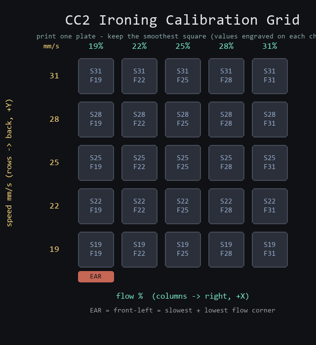

# CC2 Ironing Calibration Grid

Print one plate, keep the smoothest square, use its speed + flow for that
filament. Method from `notes/this-setting-makes-3d-prints-perfectly-smooth.md`
(NuggetsInclusive), adapted to headless CC2 slicing.



Each chip has its own **speed/flow engraved on a nameplate in front of it**
(`S25` = 25 mm/s, `F25` = 25% flow), so you never have to guess which is which.

## Print it

1. Send `CC2_IroningGrid_PLA_speed19-31_flow19-31.gcode` to the CC2 (plain Elegoo
   PLA @ECC2, textured PEI, ~2h 18m, ~16g).
2. When it finishes, look across the top of the 25 pads under good light.
3. Pick the **smoothest, most uniform** pad (no gaps, no over-extruded ridges).
4. Read its engraved `S..`/`F..` = your ironing **speed** and **flow** for this
   filament. Set those in ElegooSlicer (`ironing_speed`, `ironing_flow`,
   `ironing_type = top`) and save them into that filament profile.

## Current sweep (v2, centred on E2)

The first grid ran speed 10-30 / flow 5-25% and the pick was ~25/25, so this one
zooms in with shorter jumps:

```
              flow %  (columns, +X, ->)
              19   22   25   28   31
           +----+----+----+----+----+
  31 mm/s  |    |    |    |    |    |   fastest (back)
  28 mm/s  |    |    |    |    |    |
  25 mm/s  |    |    | E2 |    |    |   <- previous pick sits dead centre
  22 mm/s  |    |    |    |    |    |
  19 mm/s  |    |    |    |    |    |   slowest (front)
           +----+----+----+----+----+
           [EAR] = slow + low-flow corner (front-left)
   speed (rows, +Y)
```

- **Too little flow** (left): thin/streaky, tiny gaps between ironing lines.
- **Too much flow** (right): glossy but ridged/over-extruded.
- **Too fast** (top): lines not fully flattened; **too slow** (bottom): can drag.

## Regenerate / change the ranges

```bash
python calibration/ironing/build_ironing_grid.py --filament pla
# or --filament plapro
python calibration/ironing/make_map.py   # refresh the legend
```

Edit `SPEEDS` (rows) and `FLOWS` (columns) at the top of `build_ironing_grid.py`
to sweep a finer or different range, then re-run. Bigger pads read more easily
but cost print time (18mm ~= 2h; 22mm ~= 3h).

## Per filament

Ironing behaviour depends on material, brand, and colour. Calibrate each
filament once and store its values in that filament's profile. Do **not** carry
one filament's numbers to another.

## How it's built (why it's reproducible)

The CLI can only set one global `ironing_speed`/`ironing_flow`, so a real 5x5
sweep needs per-cell settings. `build_ironing_grid.py`:

1. Generates the plate (25 pads on the bed, tied by thin low ribs so it lifts as
   one piece; an ear marks the origin; each pad's speed/flow engraved on a low
   nameplate) as a pure-box STL - no CAD dependency.
2. Slices once with `tools/slice_cc2.py` (validated CC2 tuning +
   `ironing_type=top` at a known base flow/speed).
3. Rewrites the `;TYPE:Ironing` moves per grid cell: feedrate `F` per row
   (speed), extrusion `E` per column (flow), scaled from the header's base flow.
   This is the XY analog of `build_tower.py`'s per-Z temperature injection.
4. Verifies all 25 cells got the right speed and exact flow ratio, on-bed, then
   writes the G-code + `verification.json`.

Labels are recessed (engraved), so ironing the raised background flat leaves the
strokes as legible matte recesses. Nameplates, ribs, and ear iron at the base
setting (not read). Ironing line spacing stays at the profile default (0.15 mm);
only speed and flow are swept, matching the source video's two axes.

## Files

- `build_ironing_grid.py` - generator + slicer + post-processor + verifier
- `make_map.py` - draws `ironing_grid_map.png` from the current ranges
- `ironing_grid.stl` - the plate geometry
- `CC2_IroningGrid_PLA_speed19-31_flow19-31.gcode` - ready to print
- `ironing_grid_map.png` - the legend above
- `verification.json` - what was validated

**Not yet physically printed at these settings** - verified in G-code only.
