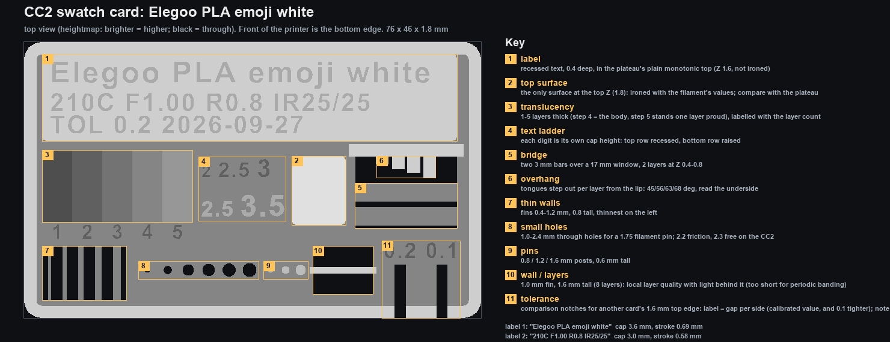

# CC2 filament swatch card (one per spool)

Our own swatch card for the Elegoo Centauri Carbon 2: a 76 x 46 mm card that
shows a filament's colour and finish, carries a **recessed-text label generated
from `filaments/<slug>.md`** (brand/material/colour, temp, flow, retraction,
ironing, tolerance, date) and packs 11 small **visual checks** tuned to what the
CC2 can show at 0.20 mm layers. Verify-only: nothing on the card is varied, the
finding is done by `calibration/card/`. Inspired by PolyNova's "Filliment card
V3" (MakerWorld 1948423, BY-NC) and Makkuro's swatch (Printables 27814); the
geometry is our own, generated by `build_swatch.py` (no CAD dependency:
TrueType outlines via fontTools, shapely, trimesh + manifold booleans).



Storage (Gridfinity bin; the Makkuro-style box is archived, sized from
`card_dims.json`): see [`storage/README.md`](storage/README.md).

## Make a card for a filament (one command)

```bash
python filaments/swatch/build_swatch.py elegoo-pla-emoji
```

That reads `filaments/elegoo-pla-emoji.md`, builds the STL, slices it with
`tools/slice_cc2.py` (the author's CC2 tuning, `--accel antiwobble`, `--no-brim --no-arrange`, `ironing_type=topmost`), verifies the G-code
and writes `cards/<slug>/`:

| File | What |
|---|---|
| `CC2_Swatch_<slug>.gcode` | ready to print, CANVAS slot 1 (`T0`), textured PEI, no supports, no brim |
| `card.stl` | the geometry (bed-centred) |
| `preview.png` | top view + key |
| `manifest.json` | every region, label line and text metric in mm |
| `verification.json` | what was checked, slicer estimate, hashes |

Frontmatter keys it uses (missing ones are simply left off the label):

| Key | On the card | Note |
|---|---|---|
| `swatch_label` (else `name`) | line 1 | keep it short: 3.6 mm caps fit ~24 chars; longer shrinks to 2.6 mm min, then truncates with `~` |
| `colour` | appended to line 1 | the md files are per brand+type, so the colour lives here (or `--colour`) |
| `temp`, `flow` | `210C F1.00` | slice values too; missing = the stock preset's value is used and recorded in `stock_used` |
| `retraction_mm` | `R0.8` | also passed as `filament_retraction_length` |
| `ironing` (`... 25 mm/s / 25% ...`) | `IR25/25` | also the pad's ironing speed/flow; missing = tuned defaults 15/15% |
| `tolerance_free_at_mm` | `TOL 0.2` + notch sizes | missing = 0.2 assumed for the notches, no `TOL` on the label |
| `slicer_key` | - | `slice_cc2.py --filament`; empty (e.g. PLA-CF) needs `--slicer-key` |
| - | `2026-09-27` | generation date, or `--date` |

Overrides: `--line1`, `--colour`, `--temp`, `--flow`, `--retraction`,
`--tolerance`, `--ironing "25 mm/s / 25%"`, `--date`, `--font`. `--no-slice`
for geometry + preview only. Printing from a slot other than 1 needs the
extruder assigned in a 3MF (`slice_cc2.py --slots` is a count, not a selector).

## The emoji PLA card (sliced, not yet printed)

`cards/elegoo-pla-emoji/CC2_Swatch_elegoo-pla-emoji.gcode`: Elegoo PLA @ECC2,
210 C / flow 1.00 / retraction 0.8 / ironing 25 mm/s 25%, **20 min 33 s, 5.06 g**
(slicer estimate; 4.5 g of extrusion + purge), 9 layers, 75.6 x 45.6 mm printed
footprint, `M600` count 0, single tool `T0`. Label lines:
`Elegoo PLA emoji white` (3.6 mm caps, 0.69 mm strokes) /
`210C F1.00 R0.8 IR25/25` / `TOL 0.2 2026-09-27` (3.0 mm caps, 0.58 mm strokes).

## Key (numbers as on the preview)

Hold the card label-up, front of the printer = bottom edge.

| # | Check | Where | What to look for |
|---|---|---|---|
| 1 | **Label** | top plateau (Z 1.6), text recessed 0.4 mm | reads at arm's length; crisp pocket edges, no closed counters in `e a 0 8` |
| 2 | **Top surface** | 9 x 11.5 pad, middle (the only surface at Z 1.8, so it is the only ironed one) | ironed pad vs the plain monotonic plateau: gloss, line texture, pinholes |
| 3 | **Translucency** | 5 steps left-middle, labelled `1..5` = layers (0.2 .. 1.0 mm) | hold to the light: which thickness still passes light, colour shift per layer |
| 4 | **Text ladder** | right of the steps: top row recessed `2 2.5 3`, bottom row raised `2.5 3.5` (each digit is its own cap height, mm) | the smallest size that reads: that is the minimum text size for this filament on the CC2 |
| 5 | **Bridge** | two 3 mm bars over the 17 mm window, printed at Z 0.4-0.8 | sag or hairy underside = too hot / too little cooling |
| 6 | **Overhang** | four tongues hanging from the lip above the window, 0.2/0.3/0.4/0.5 mm per layer = 45/56/63/68 deg from vertical, 7 layers | turn the card over: curled tips or dropped loops, and at which angle they start |
| 7 | **Thin walls** | comb window bottom-left: fins 0.4 / 0.6 / 0.8 / 1.0 / 1.2 mm, thinnest left | which fins exist and are solid (classic walls, thin-wall detection off in the profile) |
| 8 | **Small holes** | six holes: 1.0 / 1.5 / 2.0 / 2.2 / 2.3 / 2.4 mm, smallest left | push a 1.75 filament end in: CC2 reference is 2.2 friction, 2.3 free, 2.4 loose (`bd memories cc2-vertical`) |
| 9 | **Pins** | three posts 0.8 / 1.2 / 1.6 mm, 0.6 tall | the smallest post that printed as a round dot rather than a blob |
| 10 | **Wall / layers** | 1.0 mm fin, 1.6 tall (8 layers), across the small window | light behind it: even layer lines, blobs, seam. Eight layers show local layer quality only, not periodic Z banding (that needs a tall print) |
| 11 | **Tolerance** | two comparison notches on the bottom edge, labelled with the gap per side (`0.2` = the calibrated `tolerance_free_at_mm`, `0.1` = one step tighter), 1.6 + 2 x gap wide, for another card's 1.6 mm top edge | slide a second card's label edge into each and note which slides. It is a comparison, not a pass/fail: the source tolerance value was a hand feel on a 6 mm hex, not a measured slot clearance. Caliper the notch and the edge before using the number in a design |

Everything sits between Z 0 and 1.8; the card stores flat or on its bottom /
right edge. The back shows the textured-PEI first layer, the bridge undersides
and the overhang tongues.

## Design notes (why it looks like this)

- **Time.** The CC2 antiwobble profile is move-count bound (~40 ms per move):
  a card of small features costs ~20 min however small it is. Text is the big
  item: each letter is a pocket with walls on 2 layers plus a floor of tiny
  "top surface" moves. Ironing the label zone was tried first and cost 4-5 min
  because the letters chop every ironing line into ~1 mm pieces, so the
  plateau stays a plain monotonic top and only the 9 x 11.5 pad is ironed
  (633 mm of ironing, ~40 s). Body 1.0 -> 0.8 saved a layer (~2 min). Glyph
  outline simplification (0.02 mm) changed nothing: the slicer already merges
  fine vertices; it only shrinks the STL.
- **Legibility floor.** Classic wall generator, 0.42 mm lines: a recessed
  stroke narrower than ~0.5 mm closes up, a raised one becomes a single
  wobbly bead. Arial Bold strokes are 0.19 x cap height, so the label never
  drops below 2.6 mm caps (0.5 mm strokes); the ladder tells you where the
  real floor is on each filament (2.0 mm caps = 0.38 mm strokes is expected to
  fail recessed).
- **Layer arithmetic.** Every Z is a multiple of 0.2: body 4 layers, rim and
  plateau 8, pad 9. Text 2 layers deep, raised text 2 layers up, bars 2
  layers, tongues start on layer 2 so layer 1 stays a clean first layer.
- **Label rows** are stacked by their real ink bounds (descenders of `g j p y`
  included) with 0.6 mm clearance, asserted >= 0.5 mm on the final polygons,
  so the wall between two rows is always at least one 0.42 mm line. Stacking
  by cap height alone left 0.04 mm between `emoji` and `210C` (Astra review).
- **No on-card check numbers.** Measured cost of recessed text on the CC2 is
  ~6.5 s per glyph (55 label glyphs = ~6 min of the 20); 11 check numbers (13
  glyphs) would add ~85 s, over the 1 min budget for it. The preview and the
  key above carry the numbers; the checks themselves are self-describing
  (sizes increase left to right, ladder digits are their own size).
- **Slot 1 only.** The G-code is `T0`; put the spool in CANVAS slot 1 or
  assign the extruder in a 3MF.

## Change it

Constants at the top of `build_swatch.py` (`W, H`, Z levels, every check's
position and sizes, `LABEL_CAPS`, `LABEL_MIN_CAP`). A size change must also go
into `card_dims.json` (the storage generator reads it). The script asserts
the mesh is watertight, that the label fits the plateau and the comb fits its
window, and refuses a G-code with `M600`, a second tool, ironing anywhere but
the top layer, the wrong layer count, or a printed footprint off by > 0.6 mm.

**Not yet physically printed.** First print to watch: the 0.4 mm fin and the
2.0 mm recessed digit (expected to fail, that is the point), the tongues'
tips, and whether the recessed label reads well enough without ironing. If it
does not, the switch is `PLATEAU_Z = 1.8` + `PAD_Z = 1.6` (label becomes the
ironed topmost surface again, +4-5 min).
