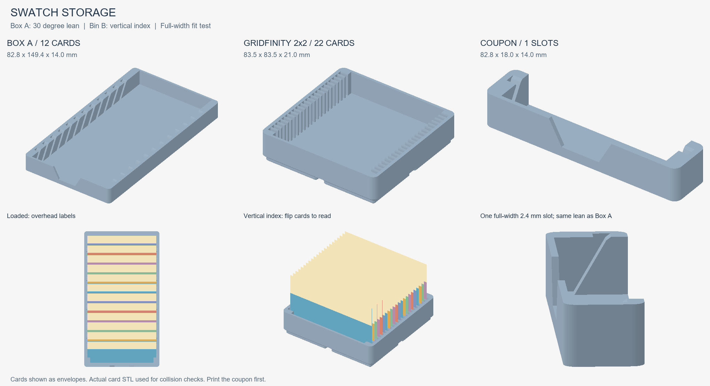

# Storage for the 76 x 46 mm filament swatch card



## Print files

**Use the Gridfinity bin (2026-09-27, user choice).** Box A and its fit test
(a section of Box A) are archived in `archive/`; `build_storage.py` still
generates them if ever needed.

| File (matching STL alongside) | Outside X x Y x Z, mm | Capacity | Estimated time | PLA |
|---|---|---|---|---|
| ARCHIVED [CC2_SwatchBoxA_12cards.gcode](archive/CC2_SwatchBoxA_12cards.gcode) / [STL](archive/CC2_SwatchBoxA_12cards.stl) | 82.8 x 149.4 x 14 | 12 | 1h 11m 6s | 32.06 g |
| [CC2_SwatchBinB_2x2_22cards.gcode](CC2_SwatchBinB_2x2_22cards.gcode) / [STL](CC2_SwatchBinB_2x2_22cards.stl) | 83.5 x 83.5 x 21 | 22 | 1h 23m 18s | 32.98 g |
| ARCHIVED [CC2_SwatchFitTest.gcode](archive/CC2_SwatchFitTest.gcode) / [STL](archive/CC2_SwatchFitTest.stl) | 82.8 x 18 x 14 | 1 test slot | 15m 0s | 5.32 g |

Times and weights are slicer estimates, not measured prints. Box A is about
32 g / 71 minutes against the approximate 30 g / 65 minute target.
Print each separately, flat as supplied: CC2, 0.20 mm layers, PLA, CANVAS
slot 1 (T0), 210 C nozzle / 60 C textured PEI, flow 0.98, auxiliary fan off.
Antiwobble acceleration is retained: 3000 / outer 2000 / top 1500 mm/s2,
outer walls 120 mm/s. No supports, ironing or brim. Two wall loops, 15% cubic
infill, three top and three bottom layers; the 1 mm floor is fully solid
because those skins overlap across its five layers. `top_shell_layers=3`
(0.6 mm) is a deliberate deviation from the five-layer tops of the slicer defaults in `tools/`
for boxes, keeping these open holders lighter and quicker to print.

## Box A and fit test

Box A retains twelve cards at 10.6 mm pitch, leaning 30 degrees from vertical.
The bottom long edge seats on a 1.0 mm floor (five 0.2 mm layers).
Opposing channels span a real 78 mm inner length. The 4 mm combs engage 3 mm
of each short-edge rim when centered, with 2 mm worst-case engagement after
the full 2 mm lateral play (previously 1 mm). The raised central pad stays
clear. End walls are
1.6 mm and side walls 2.4 mm. Overall default wall height is 14 mm from the bed,
so the card engagement above the floor is 13 mm.

Labels are fully readable from straight above (18.08 mm exposed face versus
the 16.5 mm label band). At a 45 degree desk view only the name line shows.
Loaded height is about 41.74 mm. The preview uses card envelopes, not rendered text.

The fit test is a one-slot, full-width end section of Box A: 82.8 x 18 x 14 mm,
78 mm inner length, the same floor, comb engagement, default slot and lean.
It has an open cut end instead of a rear wall. Insert a real card with the
label up and facing the finger scallop, sliding along the lean. Check full
seating, lean and easy withdrawal without forcing. The card overhangs the
short section; steady it by hand. This tests seating, not full-box stability.

## Vertical index bin B

Original geometry following the vertical indexing pattern requested from
[MikkoP model 276758](https://www.printables.com/model/276758).
Gridfinity 2x2, 83.5 x 83.5 mm, 3U (21 mm overall height), 79 mm inner slot
length. Twenty-two slots are 2.4 mm wide at 3.4 mm pitch, with 1.0 mm ribs.
Ribs have a 0.2 mm entry flare on each side over the last 0.8 mm of height,
leaving a 0.6 mm tip. Cards stand vertically on their bottom long edge,
proud of the walls (loaded height 51.75 mm); use a drawer at least 8U (56 mm)
high with sufficient clear internal height. Flip through them to read labels.
The narrow slots locate the lower edges: lift slightly to turn a card rather
than forcing it against a rib. There is no lean-and-show spacing.

Four Gridfinity feet use 42 mm pitch and a 4.75 mm profile: 0.8 mm lower
chamfer, 1.8 mm straight, 2.15 mm upper chamfer. Square widths at
Z 0 / 0.8 / 2.6 / 4.75 are 35.6 / 37.2 / 37.2 / 41.5 mm. The 1 mm floor
above the base runs from Z 4.75 to 5.75 (slicer layers quantize to 0.2 mm).
There are no magnets, screw holes or stacking lip. Side walls are 2.25 mm,
end walls 1.6 mm. The side ribs extend 5.5 mm into the 79 mm cavity, engaging
4 mm of each card when centered. With all 3 mm of lateral play taken up,
the opposite side still engages 2.5 mm (previously 0.5 mm). A 5 mm rib would
leave only 2 mm, so 5.5 mm is required for the verified 2.5 mm minimum.

## Slot clearance and parameters

Slots are sized to `edge_thickness_mm = 1.6` from
[card_dims.json](../card_dims.json). The central 1.8 mm pad never enters a slot.
`slot = edge_thickness_mm + clearance`; default `--clearance 0.8` gives
2.4 mm, or 0.4 mm per side. The review's '0.6 clearance' and '2.4 slot'
are arithmetically inconsistent for a 1.6 mm edge: `--clearance 0.6` gives
2.2 mm. The requested 2.4 mm default takes precedence.

`--wall-height` defaults to 14 mm and affects Box A and the fit test only.
20 mm gives more grip if the box travels; B remains fixed at 3U.
`--count` defaults to 12 and affects A only. `--angle` defaults to 30 degrees
(20..40), affecting A and the fit test; B stays vertical. B preserves 1 mm
ribs when clearance changes and recalculates capacity (maximum 22).
`--dims` accepts another dimension JSON. Geometry exceeding a 246 mm bed
footprint is rejected. Test a new card size physically.

From the repo root:

```powershell
python -B filaments/swatch/storage/build_storage.py --slice
# Optional travel variant in a separate folder:
python -B filaments/swatch/storage/build_storage.py --wall-height 20 --out filaments/swatch/storage/travel --slice
```

Dependencies: numpy, trimesh, manifold3d, shapely, mapbox-earcut, Pillow.
The generator writes descriptive STLs and G-code directly to the output
folder. Profiles, slice logs and console logs stay in uniquely named
`%TEMP%/swatch-storage-*` directories.
Omitting `--slice` refreshes geometry and its report only; existing G-code
is not refreshed. Use a separate `--out` for variants.

## Verification

[verification.json](verification.json) records hashes, dimensions, capacity,
real-card intersections, worst-case side engagement, slicer commands/settings
and actual extrusion bounds. Engagement is asserted at least 2.5 mm per side
for B and 2 mm for A and its representative fit test.
All three meshes are watertight single solids. Every seated card and adjacent
card pair tested has zero intersection volume within numerical tolerance,
including cards shifted to both lateral extremes and the full-width fit
test. All G-code files have M600 count 0, T0 only, no support paths, correct
sliced height and object extrusion within the 256 x 256 mm bed. Bed bounds
exclude machine startup/purge moves. The fit test is asserted under 20 minutes.
Physical clearance, loaded stability and Gridfinity mating remain untested.
Print the fit test first.

